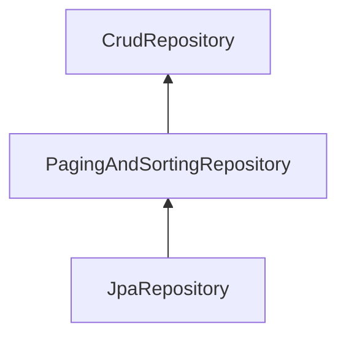

---  
layout: full
class: bg-[#858778] text-white flex flex-col items-center justify-center
---

# Definición de métodos de consulta con Spring Data JPA
---
layout: two-cols
hideInToc: true
---

# Capacidades de JpaRepository
 
- **CrudRepository**
```text
findAll(), saveAll(), deleteAll(), flush()
```

- **PagingAndSortingRepository**
    - Paginación.
    - Ordenamiento.
 
- **JpaRepository**
    - Sobreescribe los métodos de CrudRepository y retorna una List.
    - Operaciones por lotes.
    - Flush del contexto de persistencia (fuerza la sincronización de operaciones pendientes en la b.d).

::right::

## Jerarquía de repositorios


---
layout: default
hideInToc: true
---
# Incluya los siguientes atributos en la entidad Instructor y en la respectiva tabla
- hireDate, active

<div style="max-height: 350px; overflow-y: auto;">

```java

@Entity
@Table(name="instructor")
public class Instructor {
    // define the fields
    // annotate the fields with db column names

    @Id
    @GeneratedValue(strategy = GenerationType.IDENTITY)
    @Column(name="id")
    private int id;

    @Column(name="first_name")
    private String firstName;

    @Column(name="last_name")
    private String lastName;

    @Column(name="email")
    private String email;

    @Column(name="hire_date")
    private LocalDate hireDate;

    @Column(name="active")
    private boolean active;
    // agregue los métodos accesores y modificadores
```
</div>

---
layout: default
hideInToc: true
---
# Agregue los siguientes métodos en InstructorRepository

| Signatura del método | Equivalencia en SQL |
| :--- | :--- |
| `List<Instructor> findByFirstNameAndEmail(String firstName, String email);` | `WHERE firstName=? and email=?` |
| `List<Instructor> findByHireDateBetween(LocalDate start, LocalDate end);` | `WHERE hire_date BETWEEN ? AND ?` |
| `List<Instructor> findAllByOrderByFirstNameAsc();` | `ORDER BY first_name ASC` |
| `List<Instructor> findByActiveOrderByFirstNameDesc(int active);` | `ORDER BY first_name DESC` |
| `List<Instructor> findByHireDateIn(Collection<LocalDate> dates);` | `WHERE hire_date IN (?, ?, ...)` |


---
layout: default
hideInToc: true
---
# Otras capacidades para consultas
- Operadores de comparación
    - LessThan
    - LessThanEqual
    - GreaterThan
    - GreaterThanEqual
    - Between
- Consultas de búsqueda de texto
    - Containing
    - StartingWith
    - EndingWith
    - IgnoreCase
    - Like
    - NotLike
    
---
layout: full
class: bg-[#858778] text-white flex flex-col items-center justify-center
---

# Limitación de resultados, ordenamiento y paginación

## Spring Data JPA

---
hideInToc: true

# ¿Por qué limitar resultados?

En aplicaciones reales no siempre se deben recuperar todos los registros.

### Casos comunes

- Mostrar los productos más recientes.
- Obtener los primeros resultados de una búsqueda.
- Mostrar resultados por páginas.
- Evitar cargar grandes volúmenes de datos en memoria.
---

# Limitar Resultados con First y Top

Spring Data permite recuperar únicamente los primeros registros encontrados.

```java
Instructor findFirstByOrderByFirstNameAsc();

Instructor findTopByOrderByHireDateDesc();
```

### Interpretación

- Retorna el instructor con el nombre más pequeño alfabéticamente.
- Retorna el instructor contratado más recientemente.

---
hideInToc: true

# Obtener los N primeros registros

También es posible indicar la cantidad máxima de resultados.

```java
List<Instructor> findFirst2ByActive(
    int active,
    Sort sort);
```

Ejemplo:

```java
List<Instructor> instructors =
    instructorRepository.findFirst2ByActive(
        True,
        Sort.by("hireDate")
    );
```

Resultado:

- Solo 2 instructores.
- Ordenados por fecha de contratación.

---
hideInToc: true

# Ordenamiento (Sorting)

Spring Data utiliza la clase `Sort`.

```java
List<Instructor> findByActive(
    int active,
    Sort sort);
```

Uso:

```java
instructorRepository.findByActive(
    true,
    Sort.by("hireDate")
);

// Sort.by("hireDate").descending()
```

---

# Paginación

La paginación divide los resultados en bloques pequeños.

```java
Page<Instructor> findAll(
    Pageable pageable);
```

Implementación habitual:

```java
PageRequest.of(
    pagina,
    tamañoPagina
);
```

---
hideInToc: true

# Solicitando una Página

```java
Page<Instructor> instructors =
    instructorRepository.findAll(
        PageRequest.of(1, 3)
    );
```

Interpretación:

```text
Página: 1
Tamaño: 3
```

Recordar: La numeración comienza en 0.

| Página | Registros |
|----------|----------|
| 0 | 1-3 |
| 1 | 4-6 |
| 2 | 7-9 |

---
hideInToc: true

# Paginación con ordenamiento

Se puede combinar ambas capacidades.

```java
PageRequest.of(
    0,
    5,
    Sort.by("hireDate")
);
```

Resultado:

- Primera página.
- Cinco registros.
- Ordenados por fecha de registro.

