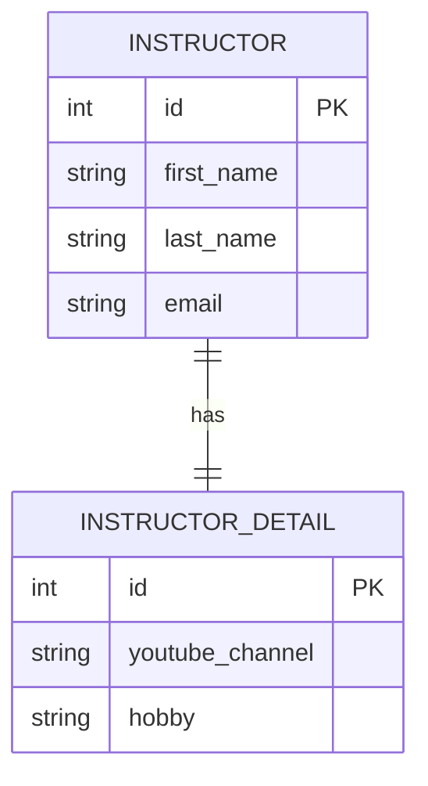

---  
layout: full
class: bg-amber-800 text-white flex flex-col items-center justify-center
bibFile: references.bib
---

# Mapeos avanzados en Hibernate: One-to-One unidireccional


---

## 🧩 ¿Qué es una relación One-to-One?

Un registro en la tabla **A** está asociado **exactamente con un** registro en la tabla **B**, y viceversa.

- **Ejemplo del dominio:** 
  - Un `Instructor` tiene un único detalle profesional (`InstructorDetail`).
  - El detalle pertenece exclusivamente a ese instructor.



---
layout: default
hideInToc: true
---
# Creación de la entidad dependendiente InstructorDetail

Esta clase representa la información secundaria. 

No conoce al instructor ya que forma parte de un mapeo unidireccional.

<div style="max-height: 400px; overflow-y: auto;">

```java
package edu.academy.coursemng.entity;

import jakarta.persistence.*;

// annotate the class as an entity and map to db table
@Entity
@Table(name="instructor_detail")
public class InstructorDetail {
    // define the fields
    // annotate the fields with db column names
    @Id
    @GeneratedValue(strategy = GenerationType.IDENTITY)
    private int id;

    @Column(name="youtube_channel")
    private String youtubeChannel;

    @Column(name="hobby")
    private String hobby;

    // create constructors
    public InstructorDetail() {

    }

    public InstructorDetail(String youtubeChannel, String hobby) {
        this.youtubeChannel = youtubeChannel;
        this.hobby = hobby;
    }

    public int getId() {
        return id;
    }

    public void setId(int id) {
        this.id = id;
    }

    public String getYoutubeChannel() {
        return youtubeChannel;
    }

    public void setYoutubeChannel(String youtubeChannel) {
        this.youtubeChannel = youtubeChannel;
    }

    public String getHobby() {
        return hobby;
    }

    public void setHobby(String hobby) {
        this.hobby = hobby;
    }
}
```
</div>

---
layout: default
hideInToc: true
---
# Creación de la entidad principal Instructor

En esta clase se configura la anotación clave @OneToOne junto con la llave foránea mediante @JoinColumn
<div style="max-height: 400px; overflow-y: auto;">

```java
package edu.academy.coursemng.entity;

import jakarta.persistence.CascadeType;
import jakarta.persistence.Column;
import jakarta.persistence.Entity;
import jakarta.persistence.GeneratedValue;
import jakarta.persistence.GenerationType;
import jakarta.persistence.Id;
import jakarta.persistence.JoinColumn;
import jakarta.persistence.OneToOne;
import jakarta.persistence.Table;

// annotate the class as an entity and map to db table
@Entity
@Table(name="instructor")
public class Instructor {
    // define the fields
    // annotate the fields with db column names

    @Id
    @GeneratedValue(strategy = GenerationType.IDENTITY)
    @Column(name="id")
    private int id;

    @Column(name="first_name")
    private String firstName;

    @Column(name="last_name")
    private String lastName;

    @Column(name="email")
    private String email;

    // ** set up mapping to InstructorDetail entity
    @OneToOne(cascade = CascadeType.ALL)
    @JoinColumn(name = "instructor_detail_id")
    private InstructorDetail instructorDetail;

    public Instructor() {

    }

    public Instructor(String firstName, String lastName, String email) {
        this.firstName = firstName;
        this.lastName = lastName;
        this.email = email;
    }

    public int getId() {
        return id;
    }

    public void setId(int id) {
        this.id = id;
    }

    public String getFirstName() {
        return firstName;
    }

    public void setFirstName(String firstName) {
        this.firstName = firstName;
    }

    public String getLastName() {
        return lastName;
    }

    public void setLastName(String lastName) {
        this.lastName = lastName;
    }

    public String getEmail() {
        return email;
    }

    public void setEmail(String email) {
        this.email = email;
    }

    public InstructorDetail getInstructorDetail() {
        return instructorDetail;
    }

    public void setInstructorDetail(InstructorDetail instructorDetail) {
        this.instructorDetail = instructorDetail;
    }

}

```
</div>

---
layout: default
hideInToc: true
---
# Aspectos fundamentales

* @OneToOne: Le indica a Hibernate que existe una relación de uno a uno entre las dos entidades.

* cascade = CascadeType.ALL: ¡Cuidado! Propaga todas las operaciones de persistencia (PERSIST, MERGE, REMOVE, REFRESH) desde el Instructor hacia su InstructorDetail asociado automáticamente.

* @JoinColumn(name = "..."): Define la columna física en la base de datos que actuará como Foreign Key (FK) apuntando a la tabla relacionada.

---
layout: default
hideInToc: true
---

# Creación de la interface Repository
```java
package edu.academy.coursemng.repository;

import org.springframework.data.jpa.repository.JpaRepository;

import edu.academy.coursemng.entity.Instructor;

public interface InstructorRepository extends JpaRepository<Instructor, Integer> {
    // add custom finder methods if needed, e.g.List<Instructor> findByLastName(String name);
}
```

* "Actúa como la capa de acceso a datos al extender `JpaRepository`."

* **CRUD integrado:** Métodos listos para usar como `save()` y `findAll()`.
* **Cero SQL:** Evita escribir consultas repetitivas.
* **Magia de Spring:** Genera las implementaciones automáticamente.

---
layout: default
hideInToc: true
---
# Creación de la capa Service

<div style="max-height: 400px; overflow-y: auto;">

```java
package edu.academy.coursemng.service;

import java.util.List;

import org.springframework.beans.factory.annotation.Autowired;
import org.springframework.stereotype.Service;

import edu.academy.coursemng.entity.Instructor;
import edu.academy.coursemng.repository.InstructorRepository;
import jakarta.transaction.Transactional;

@Service
@Transactional
public class InstructorService {
    private final InstructorRepository instructorRepository;

    @Autowired
    public InstructorService(InstructorRepository instructorRepository) {
        this.instructorRepository = instructorRepository;
    }

    public List<Instructor> getAllInstructors() {
        return instructorRepository.findAll();
    }
    
    public Instructor getInstructorById(int id) {
        return instructorRepository.findById(id).orElse(null);
    }
    
    public Instructor saveInstructor(Instructor instructor) {
        return instructorRepository.save(instructor);
    }

}

````
</div>

---
layout: default
hideInToc: true
---
# Creación de la capa Service

## @Service (Lógica de Negocio)
* Estereotipo de Spring: Especialización de @Component para registrar beans automáticamente.
* Claridad semántica: Indica explícitamente que la clase contiene las reglas y operaciones del negocio.
* Punto de unión: Conecta los controladores web y rest con la capa de persistencia (repositorios).
## @Transactional (Integridad)
* Atomicidad (Todo o nada): Garantiza que un conjunto de operaciones de base de datos se ejecute como una unidad.
* Reversión automática: Si ocurre una excepción (RuntimeException), todos los cambios se revierten (rollback).

---
layout: default
hideInToc: true
---
# Creación de un controlador REST

<div style="max-height: 400px; overflow-y: auto;">

```java
package edu.academy.coursemng.controller.rest;

import java.util.List;

import org.springframework.http.ResponseEntity;
import org.springframework.web.bind.annotation.RequestMapping;
import org.springframework.web.bind.annotation.RestController;
import org.springframework.web.bind.annotation.GetMapping;
import org.springframework.web.bind.annotation.PathVariable;
import org.springframework.web.bind.annotation.PostMapping;
import org.springframework.web.bind.annotation.RequestBody;

import edu.academy.coursemng.entity.Instructor;
import edu.academy.coursemng.service.InstructorService;


@RestController
@RequestMapping("/api/instructors")
public class InstructorRestController {
    private final InstructorService instructorService;

    public InstructorRestController(InstructorService instructorService) {
        this.instructorService = instructorService;
    }

    @GetMapping()  
    public ResponseEntity<List<Instructor>> getAllInstructors() {
        List<Instructor> instructors = instructorService.getAllInstructors();
        return ResponseEntity.ok(instructors);
    }
    
    @GetMapping("/{id}")
    public ResponseEntity<Instructor> getInstructorById(@PathVariable int id) {
        Instructor instructor = instructorService.getInstructorById(id);
        if (instructor == null) {
            return ResponseEntity.notFound().build();
        }
        return ResponseEntity.ok(instructor);
    }

    @PostMapping()
    public ResponseEntity<Instructor> saveInstructor(@RequestBody Instructor instructor) {
        Instructor savedInstructor = instructorService.saveInstructor(instructor);
        return ResponseEntity.ok(savedInstructor);
    }
}
```
</div>

---
layout: default
hideInToc: true
---
# Creación de un archivo de llamados http

<div style="max-height: 400px; overflow-y: auto;">

```http
@baseUrl = http://localhost:8084/coursemng

### Search instructors by name or subject
GET {{baseUrl}}/api/instructors
Accept: application/json
Content-Type: application/json

### Search by id
GET {{baseUrl}}/api/instructors/1
Accept: application/json
Content-Type: application/json

### Create instructor
POST {{baseUrl}}/api/instructors
Content-Type: application/json
Accept: application/json

{
  "firstName": "Alvaro",
  "lastName": "Mena",
  "email": "a@a.com",
  "instructorDetail": {
    "youtubeChannel": "https://www.youtube.com/@veritasium",
    "hobby": "software"
  }
}
```
</div>