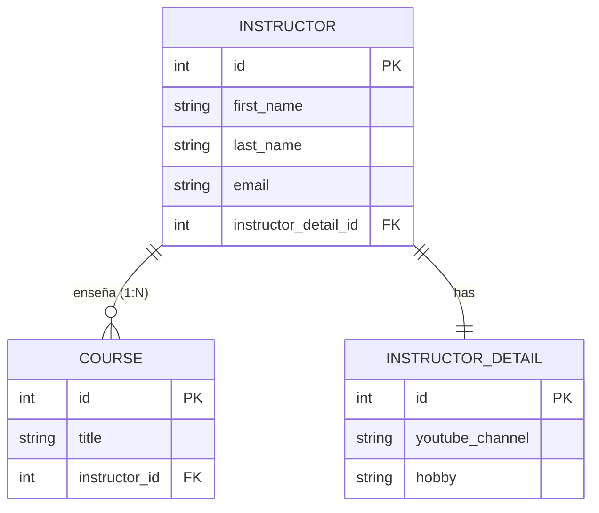

---  
layout: full
class: bg-[#858778] text-white flex flex-col items-center justify-center
hideInToc: false
---

# Mapeos avanzados en Hibernate: One-to-Many bidireccional

---
layout: two-cols
hideInToc: true
---

# 🧩 ¿Qué es una relación One-to-Many?

Un instructor puede impartir **múltiples cursos**, pero un curso pertenece a **un único instructor**.

- **Lado "One" (principal):** `Instructor` (tiene una lista `List<Course>`).
- **Lado "Many" (dependiente):** `Course` (contiene la clave foránea `instructor_id`).

::right::


---
layout: default
hideInToc: true
---
# Creación de la entidad dependendiente Course

El lado propietario (owning side) de la relación a nivel de base de datos, configurado con \@ManyToOne

<div style="max-height: 400px; overflow-y: auto;">

```java
package edu.academy.coursemng.entity;

import jakarta.persistence.*;

@Entity
@Table(name="course")
public class Course {

    // define and annotate fields
    @Id
    @GeneratedValue(strategy = GenerationType.IDENTITY)
    @Column(name="id")
    private int id;

    @Column(name="title")
    private String title;

    @ManyToOne(cascade = {CascadeType.PERSIST, CascadeType.MERGE, 
                          CascadeType.DETACH, CascadeType.REFRESH})
    @JoinColumn(name="instructor_id")
    private Instructor instructor;

    public Course() {

    }

    public Course(String title) {
        this.title = title;
    }

    public int getId() {
        return id;
    }

    public void setId(int id) {
        this.id = id;
    }

    public String getTitle() {
        return title;
    }

    public void setTitle(String title) {
        this.title = title;
    }

    public Instructor getInstructor() {
        return instructor;
    }

    public void setInstructor(Instructor instructor) {
        this.instructor = instructor;
    }

}
```
</div>
---
layout: default
hideInToc: true
---
# Ajustar la entidad principal: Instructor y su Método Helper

Se debe configurar la colección courses junto con la propiedad mappedBy, un método auxiliar indispensable y métodos set y get para la colección.

<div style="max-height: 350px; overflow-y: auto;">
```java
package edu.academy.coursemng.entity;

import jakarta.persistence.*;
import java.util.ArrayList;
import java.util.List;

@Entity
@Table(name = "instructor")
public class Instructor {
    // ... campos de id, first_name, last_name, email, instructorDetail

    @OneToMany(mappedBy = "instructor", 
               cascade = {CascadeType.PERSIST, CascadeType.MERGE,
                          CascadeType.DETACH, CascadeType.REFRESH})
    private List<Course> courses;

    // Método helper vital para sincronizar ambos lados de la relación
    public void add(Course course) {
        if (courses == null) {
            courses = new ArrayList<>();
        }
        courses.add(course);
        course.setInstructor(this); //Le dice al Course quién es su Instructor
    }
}
```
</div>