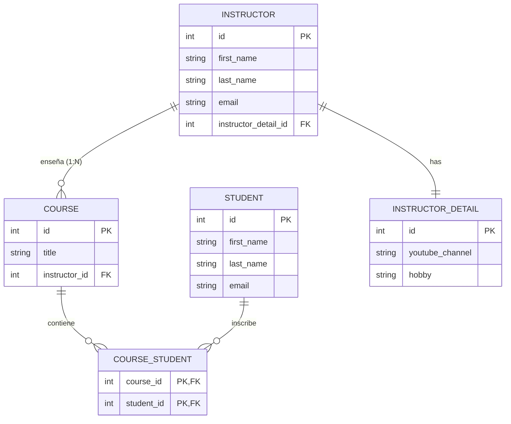

---  
layout: full
class: bg-[#858778] text-white flex flex-col items-center justify-center
bibFile: references.bib
hideInToc: false
highlighter: shiki
---

# Mapeos avanzados en Hibernate: Many-to-Many bidireccional

---
layout: two-cols
hideInToc: true
---

# 🧩 ¿Qué es una relación Many-to-Many?

- Un **Curso** (`Course`) puede tener **muchos estudiantes** matriculados.
- Un **Estudiante** (`Student`) puede inscribirse en **muchos cursos**.
- Para relacionarlos a nivel de base de datos relacional, necesitamos obligatoriamente una **tabla Intermedia** (`course_student`).

::right::


--
layout: default
hideInToc: true
---
# Creación de la entidad propietaria Course

La entidad Course define el lado principal de la relación y la configuración de la tabla intermedia.

<div style="max-height: 400px; overflow-y: auto;">

```java
package edu.academy.coursemng.entity;

import jakarta.persistence.*;
import java.util.ArrayList;
import java.util.List;

@Entity
@Table(name="course")
public class Course {
    @Id
    @GeneratedValue(strategy = GenerationType.IDENTITY)
    @Column(name="id")
    private int id;

    @Column(name="title")
    private String title;

    @ManyToOne(cascade = {CascadeType.PERSIST, CascadeType.MERGE, 
                          CascadeType.DETACH, CascadeType.REFRESH})
    @JoinColumn(name="instructor_id")
    private Instructor instructor;

    @ManyToMany(fetch = FetchType.LAZY,
            cascade = {CascadeType.PERSIST, CascadeType.MERGE,
            CascadeType.DETACH, CascadeType.REFRESH})
    @JoinTable(
            name = "course_student",
            joinColumns = @JoinColumn(name = "course_id"),
            inverseJoinColumns = @JoinColumn(name = "student_id")
    private List<Student> students;

    // Métodos helper, constructores y getters/setters
    public void addStudent(Student theStudent) {

        if (students == null) {
            students = new ArrayList<>();
        }

        students.add(theStudent);
    }
}
```

</div>


---
layout: default
hideInToc: true
---

# Creación de la entidad Student

La entidad Student mapea la relación inversa utilizando el atributo mappedBy.

<div style="max-height: 400px; overflow-y: auto;">

```java {|25-30|} 
package edu.academy.coursemng.entity;

import java.util.ArrayList;
import java.util.List;

import jakarta.persistence.CascadeType;
import jakarta.persistence.Column;
import jakarta.persistence.Entity;
import jakarta.persistence.FetchType;
import jakarta.persistence.GeneratedValue;
import jakarta.persistence.GenerationType;
import jakarta.persistence.Id;
import jakarta.persistence.ManyToMany;
import jakarta.persistence.Table;

@Entity
@Table(name = "student")
public class Student {

    @Id
    @GeneratedValue(strategy = GenerationType.IDENTITY)
    @Column(name = "id")
    private int id;

    @Column(name = "first_name")
    private String firstName;

    @Column(name = "last_name")
    private String lastName;

    @Column(name = "email")
    private String email;

    @ManyToMany(fetch = FetchType.LAZY,
            cascade = {CascadeType.PERSIST, CascadeType.MERGE,
                    CascadeType.DETACH, CascadeType.REFRESH},
            mappedBy = "students")
    private List<Course> courses;

    public Student() {

    }

    public Student(String firstName, String lastName, String email) {
        this.firstName = firstName;
        this.lastName = lastName;
        this.email = email;
    }

    public int getId() {
        return id;
    }

    public void setId(int id) {
        this.id = id;
    }

    public String getFirstName() {
        return firstName;
    }

    public void setFirstName(String firstName) {
        this.firstName = firstName;
    }

    public String getLastName() {
        return lastName;
    }

    public void setLastName(String lastName) {
        this.lastName = lastName;
    }

    public String getEmail() {
        return email;
    }

    public void setEmail(String email) {
        this.email = email;
    }

    public List<Course> getCourses() {
        return courses;
    }

    public void setCourses(List<Course> courses) {
        this.courses = courses;
    }

    // agregar el método de conveniencia
    public void addCourse(Course theCourse) {

        if (courses == null) {
            courses = new ArrayList<>();
        }

        courses.add(theCourse);
        theCourse.addStudent(this);
    }
}
```
</div>