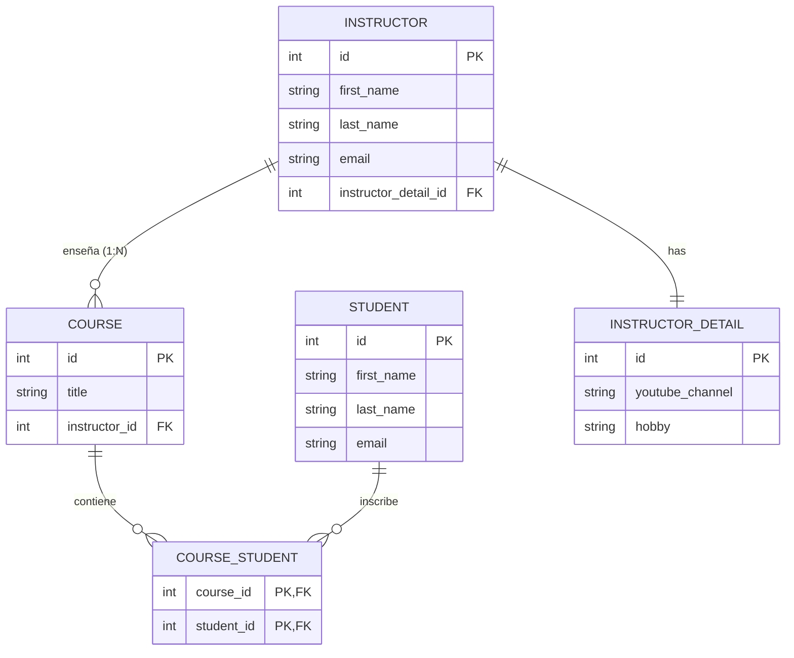

---  
layout: full
class: bg-[#858778] text-white flex flex-col items-center justify-center
bibFile: references.bib
hideInToc: false
highlighter: shiki
---

# Mapeos avanzados en Hibernate: Many-to-Many bidireccional

---
layout: two-cols

---

# 🧩 ¿Qué es una relación Many-to-Many?

- Un **Curso** (`Course`) puede tener **muchos estudiantes** matriculados.
- Un **Estudiante** (`Student`) puede inscribirse en **muchos cursos**.
- Para relacionarlos a nivel de base de datos relacional, necesitamos obligatoriamente una **tabla Intermedia** (`course_student`).

::right::

